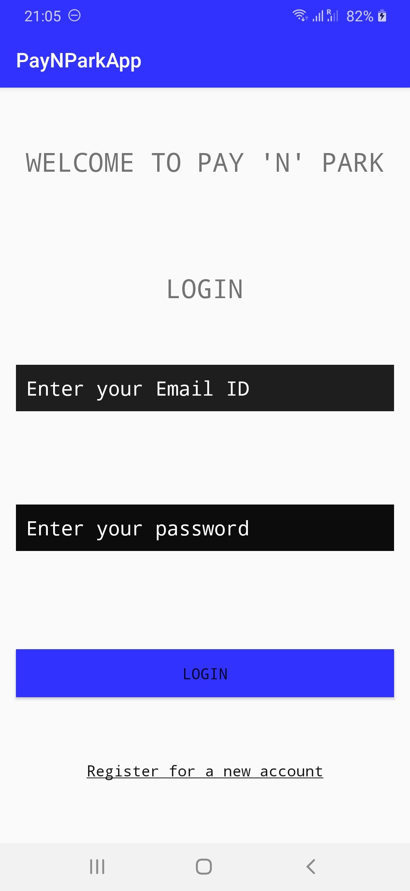
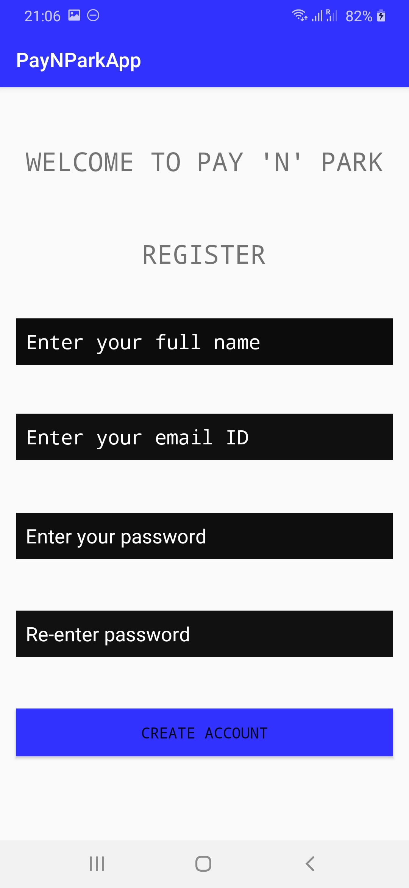
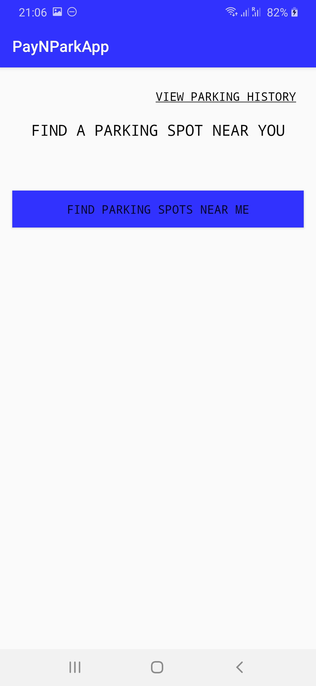
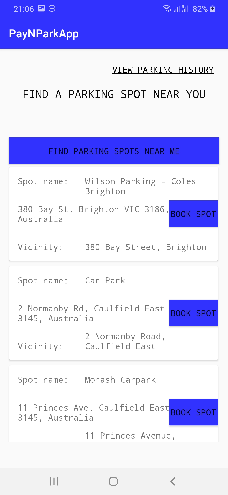
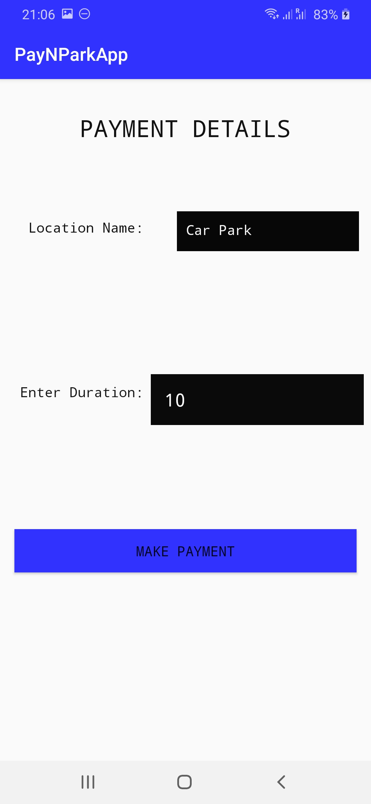
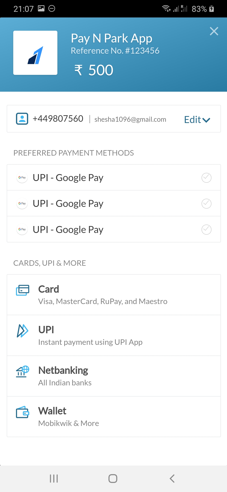
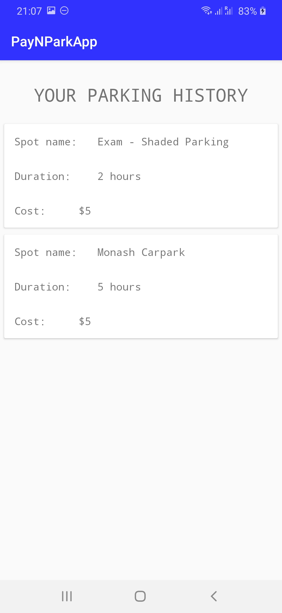

# PayNParkApp
A simple Android application that displays a number of parking locations available in the vicinity of a person's location. The app lets the user to book a particular spot for a certain duration of time.

Login Screen:

Register Screen:

Home Screen:

List of Parking Locations:

Payment Details Screen:

Payment Gateway:

Parking History Screen:

